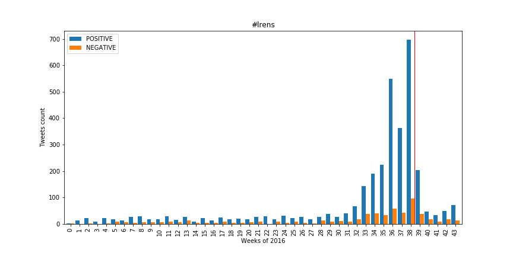
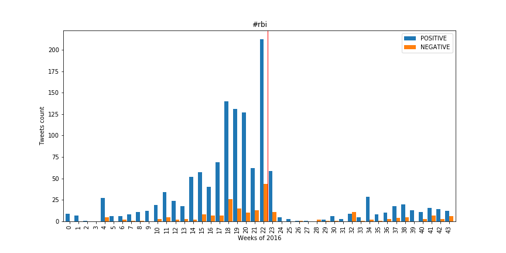

# Twitter Swiss Vote

Final project for Applied Data Analysis (CS-401).  
By Romain Gehrig and Thierry Treyer.

## Introduction

Social medias are now part of our day to day life: people use them to share their activities but also their opinions, traditional medias refer to social medias more and more often, they have become another medium for sharing informations and opinions.
Those informations are for the most part freely available on the Internet, by tapping into it we may be able to gain some insights on the opinions of the population, learn about their concerns and issues.

We took the context of votations to frame our analysis:

  * Can we observe a link between the opinions expressed on Twitter and the results of the votation?
  * Can we predict the outcome of the votation based on related tweets?
  * How does the sentiment of the public change through time?
    * Is there turning points?
    * What cause the changes
    * Does the opinion changes after the results?

As voting participation declines and is already particularly low for young people, can we poll the population's opinion through social medias?

## The Dataset

We planned to use the Swiss tweets dataset containing 5GB of tweets, but the sentiment associated with the tweets were missing.
Fortunately, we were provided the Spinn3r dataset shortly after that contained this extra information.

We downloaded the whole dataset to be able to work on our own workstation, as the expected size was around 5GB.
We would have been able to load it in memory to easily extract the features we needed, but it appeared that the Spinn3r dataset is much larger (~30GB) than the original one.
We still worked on our own workstation for the extraction of the features and the analysis, iterating on each file instead of the whole dataset at once.
But in retrospective, we should have used the provided cluster to filter the tweets.
It would have been faster and as we discovered later, the resulting subsets are small enough to be fully loaded in memory.

Since we wanted to use the hashtags to do our analysis, we did a first pass to filter out the tweets containing no hashtags and to lower the case of each tags.
This preprocessing reduced the amount of data we had to handle and simplified our following work.

### Selecting a votation

Once we cleaned our dataset, we had to select which votations we would work on.
Not knowing which ones have been discussed on Twitter, we started by researching all tweets containing the hashtag #CHVote.
This hashtag is commonly used in discussion about Swiss votation and is a good starting point for our researches.
We looked at the others tags often associated with #CHVote and came up with the following table:

| Hashtag  | Count |
|:---------|------:|
| #abst16  |   358 |
| #avsplus |   233 |
| #lrens   |   200 |
| #rbi     |   116 |

Table: Hashtags associated with #CHVote

The hashtag #astb16 related to stopping the use of nuclear energy in Switzerland is the most popular, but unfortunately the votation took place the 27th November.
Our dataset doesn't contains the tweets up to that date, so we won't be able to analyse what happens right before and after the vote and chose then to not investigate this votation.

As we were particularly curious about the discussion around the #lrens votation (about giving more power to information services in Switzerland) and around the #rbi votation (about giving every citizen a universal basic income), we limited our analysis on those two events.

### Exploring a votation

The number of tweets combining the hashtags #CHVote and #lrens, or #CHVote and #rbi being pretty low, we looked for the tweets containing just #lrens or #rbi and got the following results:

| Hashtag  | Count |
|:---------|------:|
| #lrens   |   487 |
| #rbi     |   409 |

Table: Tweets count by hashtag

The amount of tweets being pretty low, we had to find more of them.
The issue is that a votation is referred with different hashtags, for instance the name of the law in different languages.
Looking for only one of them means we miss some part of the discussions.
We looked at which other tags are often associated with our first selection to extend the list of tags we'll look after.
We also made some research manually on Twitter to find other hashtags and came up with the following list:

  * **#lrens**: lrens, lrensnon, lrensoui, loirenseignement, lscpt, etatfouineur, saveprivacy, ndg, ndgnein, stopndg, ndgja, ndb, stopndb, src, bupf, surveillance, privacy
  * **#rbi**: rbi, rbioui, rbinon, rentabásicauniversal, revenuuniversel, ubi, basicincome, grundeinkommen, rbi16, rbi2016, revenudebase, revenuuniversel, allocationuniverselle

There is a lot of different hashtags used to discuss the same subject and being in a multilingual country doesn't make it simpler, but we still came up with the following results:

| Hashtag  | Count |
|:---------|------:|
| #lrens   |  3962 |
| #rbi     |  1534 |

Table: Tweets count using extended hashtags list

Having a more diversified dataset, we took a look at the sentiments provided by Spinn3r.
We were disappointed to see that almost all tweets were classified as *neutral*.
As we won't be able to provide any meaningful observation with those sentiments, we need to compute our own ones.

| Sentiments | Count |
|:-----------|------:|
| Positive   |   325 |
| Neutral    |  3278 |
| Negative   |   249 |

Table: Sentiments for #lrens

### Computing our sentiments

We decided to use the sentiments provided by Spinn3r as the basis of our own classifier.
We will only classify the sentiment *positive* and *negative*, setting aside the *neutral* one.
This forces the classifier to consider the tweets as polarised instead of setting almost everything to *neutral*.

We started by fetching all tweets classed as *positive* and *negative*.
The resulting dataset is quite large, so we kept it splitted by files as for the Spinn3r's dataset.
We selected two of those largest files as our training set and chose an extra one as a test set.

| Tweets | Count |
|:-------|------:|
| Train set, positive | 30098 |
| Train set, negative | 14435 |
| Train set, total | 44533 |
|||
| Test set, positive | 9508 |
| Test set, negative | 4364 |
| Test set, total | 13872 |

Table: Training and testing tweets sets

We combined a TF-IDF vectorizer with a Stochastic Gradient Descent classifier to predict the sentiment of our tweets.
The following parameters have been found using a grid search.  Fortunately we did not have much troubles to get a good score.

| Evaluation method         |  Score |
|:--------------------------|-------:|
| Cross validation (5-fold) | 95.18% |
| Test set accuracy         | 91.38% |

Table: Classifier's scores

We can now finally start analyzing the opinions of the people on those votations!

## The votations

### LRens

This votation had a long live on social networks before it actually was voted with around 20 tweets about it per week for about 8 month, then we can observe a constant augmentation of the volume of the tweets seven weeks before the votation due to progressive discussion about it in the social environment.

The illustration of the number of tweets per 1000 voters was chosen to show where the tech-savy users are, in this case around Zurich and Geneva and we don't think this is a coincidence that those cities are international ones!

<iframe src="lrens_tweets.html" width="100%" height="400px"></iframe>

Both Twitter and the Swiss population approve this law!

<iframe src="lrens_sentiment.html" width="100%" height="400px"></iframe>

### RBI

Twitter's attitude toward this votation looked pretty positive.
We can see the activity increasing when we approach the date of the votation, but there is no change of opinion before or after the votation.
But Twitter was wrong since this votation was rejected by the Swiss population.

At first sight, it looks like there is a strong case of Röstigraben, but what is really happening is that we have no tweets coming from a large part of the German side of Switzerland.
The reason may be the lack of hashtags in German related to this votation (we missed the hashtag #bge), but Zurich still stand out!

<iframe src="rbi_tweets.html" width="100%" height="400px"></iframe>

We then have some surprising results.
We have Wallis that looks like a strong advocate for the RBI, but in the votation results it is one of the lowest proportion of 'yes' in the country.
And Jury was a partisan of this law both in tweets and in votes.
Those results make it hard to draw any conclusion from those graph.

<iframe src="rbi_sentiment.html" width="100%" height="400px"></iframe>

## Conclusion

It seems that using Twitter to estimate the opinion of the Swiss population provide mitigated results.
For the LRens votation, our analysis matched the opinions of the people.
For the RBI votation, it is completely wrong.

The reasons behind those results may be:

  1. **The Swiss population doesn't use Twitter enough**  
     Over a whole year, having only thousands of tweets about a subject seems fairly low.
     We saw the distribution of tweets in the state does not follow the distribution of voters. There is a huge bias toward state that are more internationally oriented, like Geneva and Zurich.
     It become hard to draw conclusions from the tweets if not enough people talk about the votations online.
  2. **The classifier is not good enough**  
     Taking a look at Spinn3r's sentiments, some of those seem really off.
     But this is not surprising considering the tweets are in three different languages, none of them being English.
     Also the classifier worked on the sentiment of the tweet and not the opinion in it, this might also skew the results.

We also didn't notice a change of opinion through time.
We saw the activity increase before the votation, but no shift of positive or negative sentiment about the subject of the votation.

Considering all those elements, we learned more about the habits of the Swiss population when discussing votations on Twitter than their actual opinions related to these votations.
